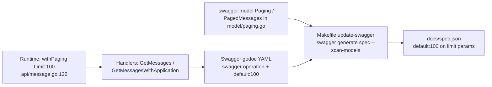

# Message-listing pagination: runtime, Swagger, and Makefile

Analysis only — no code or docs changes.

## 1. Runtime default pagination limit

The default is applied in [`api/message.go`](api/message.go) inside `withPaging`:

```121:126:api/message.go
func withPaging(ctx *gin.Context, f func(pagingParams *pagingParams)) {
	params := &pagingParams{Limit: 100}
	if err := ctx.MustBindWith(params, binding.Query); err == nil {
		f(params)
	}
}
```

- **Default when `limit` is omitted:** `100` (struct field initializer on line 122).
- **Allowed range when provided:** `1..200`, from `pagingParams` binding tags (lines 42–45).
- Gin's query binding overwrites `Limit` only when the query param is present; invalid values cause bind failure and the callback never runs (HTTP 400).

Related helpers in the same file:
- `buildWithPaging` (lines 100–119) builds the next-page URL using the effective `paging.Limit`.
- Handlers request `params.Limit+1` rows so a “has next page” check can truncate back to `Limit`.

There is no named constant; the default is the literal `100`.

---

## 2. Endpoints that use `withPaging`

Only two handlers call it:

| HTTP | Path | Handler | Call site |
|------|------|---------|-----------|
| `GET` | `/message` | `(*MessageAPI).GetMessages` | [`api/message.go`](api/message.go) lines 88–98 |
| `GET` | `/application/:id/message` | `(*MessageAPI).GetMessagesWithApplication` | [`api/message.go`](api/message.go) lines 179–198 |

Route registration in [`router/router.go`](router/router.go):
- Lines 204–206: `GET /application/:id/message` → `GetMessagesWithApplication`
- Lines 218–220: `GET /message` → `GetMessages`

Both are under `authentication.RequireClient`.

---

## 3. Swagger source annotations

This repo uses **go-swagger** YAML-in-godoc (`swagger:operation`), not swaggo `@Param` tags. Annotations live above the handlers in [`api/message.go`](api/message.go):

**`GET /message` (`getMessages`)** — lines 47–87:
- `limit`: `required: false`, `minimum: 1`, `maximum: 200`, **`default: 100`** (lines 56–63)

**`GET /application/{id}/message` (`getAppMessages`)** — lines 128–178:
- Same `limit` docs including **`default: 100`** (lines 143–150)

Response models in [`model/paging.go`](model/paging.go):
- `Paging` (`swagger:model Paging`) lines 3–36 — response `limit` has `min: 1`, `max: 200` (no default; it reflects the request that was used)
- `PagedMessages` (`swagger:model PagedMessages`) lines 38–54

---

## 4. Generated entries in `docs/spec.json`

| Path | Spec location | `operationId` | `limit` default |
|------|---------------|---------------|-----------------|
| `GET /application/{id}/message` | lines 443–526 | `getAppMessages` (466) | `"default": 100` (480) |
| `GET /message` | lines 1448–1517 | `getMessages` (1471) | `"default": 100` (1477) |

`definitions.Paging` / `PagedMessages` appear around lines 3170–3235; response `Paging.limit` documents min/max but not a default.

Today, **runtime default, annotations, and spec all agree on 100**.

---

## 5. Flow: runtime → annotations → generated spec



1. **Runtime behavior** is independent of the spec: `withPaging` initializes `Limit: 100`, then binds query params.
2. **Swagger annotations** are manually maintained godoc comments next to the handlers; they declare the documented default (`default: 100`) and constraints. They are not derived from the Go initializer.
3. **`docs/spec.json`** is produced by go-swagger scanning those comments (`--scan-models` also picks up `swagger:model` types). The Makefile post-processes `uint64` → `int64`.
4. **Drift risk for demos:** changing only the runtime initializer, or only the godoc `default:`, or regenerating after one-sided edits will desync behavior from docs (or fail `check-swagger` if the committed spec is stale).

---

## 6. Makefile targets for generate / validate

From [`Makefile`](Makefile):

| Target | Lines | Role |
|--------|-------|------|
| `download-tools` | 38–39 | Installs go-swagger pin `717e3cb29becaaf00e56953556c6d80f8a01b286` |
| `update-swagger` | 41–43 | Regenerates `docs/spec.json`, then `sed` rewrites `"uint64"` → `"int64"` |
| `check-swagger` | 45–51 | Runs `update-swagger`, `git add docs`, fails if `docs` is dirty (“Swagger Spec is not up-to-date”) |
| `check` / `check-ci` | 13–14 | Include `check-swagger` |

Note: `.PHONY` lists `verify-swagger` (line 156) but there is no matching recipe; validation is `check-swagger`.
