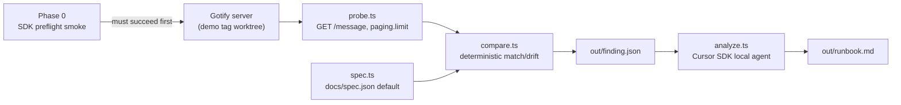

# SyncGuard Vertical Slice: Pagination Default Drift

## Verified context

- Branch `demo/pagination-doc-drift` is at the drift state: `withPaging` initializes `Limit: 50` ([api/message.go](api/message.go) line 122) while Swagger annotations and [docs/spec.json](docs/spec.json) still document `default: 100` for `getMessages` and `getAppMessages`.
- Tags `demo-00-baseline` (both `100`) and `demo-01-drift` exist locally.
- `GET /message` accepts basic auth (`RequireClient` → `handleUser`, [auth/authentication.go](auth/authentication.go)), and the response's `paging.limit` reflects the effective limit (`buildWithPaging`, [api/message.go](api/message.go) line 116). So a single probe with default `admin`/`admin` credentials reveals the runtime default.
- `make check-swagger` only regenerates the spec from annotations and diffs against the committed spec — it never observes runtime behavior, which is exactly the gap SyncGuard fills.

## Architecture (unchanged)

Two layers remain:

1. **Deterministic comparison** — code decides match/drift from concrete values.
2. **Cursor SDK analysis** — consumes the structured finding, inspects the repo, explains root cause, produces a remediation runbook.



Only `compare.ts` decides match/drift. The SDK agent never re-judges the values.

---

## Phase 0: Cursor SDK preflight

**Gate:** Do not build the detector, live Gotify probe, worktree demos, or runbook workflow until this phase succeeds.

### Goals

- Confirm a Cursor API key can be provided via `CURSOR_API_KEY` (env or local `.env` loaded only at runtime — never committed).
- Use Cursor’s native `/sdk` skill ([`~/.cursor/skills-cursor/sdk/SKILL.md`](/home/nikki/.cursor/skills-cursor/sdk/SKILL.md)) **and** the installed `@cursor/sdk` package types/docs as the source of truth for the current interface — do not rely on outdated skill examples alone.
- Run the smallest isolated smoke test that:
  - Starts a **local** agent against this repository (`cwd` = repo root).
  - Asks for a fixed one-sentence repository observation (e.g. “Reply with exactly one sentence naming the main language of this repository.”).
  - Streams the result to stdout.
  - Makes **no** file edits.
- Avoid hardcoding a model ID until supported models are verified via `Cursor.models.list()` (or the equivalent current API from the installed package).
- Confirm how the smoke run appears in the account’s usage dashboard (manual check after a successful run; document the observation in the Phase 0 notes / README).
- If `CURSOR_API_KEY` is missing, exit immediately with a clear setup message (where to create a key, how to export it / copy `.env.example` → `.env`) — do not start an agent.
- Never commit a real `.env` or API key; allow a sanitized `.env.example` with `CURSOR_API_KEY=`.

### Phase 0 file footprint (minimal scaffold only)

```
syncguard/
  package.json          # @cursor/sdk + typescript + tsx only at this stage
  tsconfig.json
  .env.example          # CURSOR_API_KEY=
  .gitignore            # node_modules/, .env, out/
  scripts/
    sdk-smoke.ts        # isolated preflight; may be kept or later folded into npm scripts
```

Detector, demo scripts, vitest, and `analyze.ts` wait until after Phase 0.

### Phase 0 procedure

1. Scaffold the minimal package above; `npm install` `@cursor/sdk`.
2. Re-read the `/sdk` skill, then inspect installed package types (e.g. under `node_modules/@cursor/sdk`) for `Agent.create` / `Agent.prompt`, streaming, `Cursor.models.list`, and disposal patterns.
3. Implement `scripts/sdk-smoke.ts`:
   - Fail fast with setup instructions if `CURSOR_API_KEY` is unset.
   - List models; pick a currently available ID (prefer a documented default such as `composer-2.5` only if present in the list).
   - Create a local agent, send the fixed one-sentence observation prompt with an explicit “do not edit any files” instruction, stream assistant text, `wait()`, dispose.
   - Print `agentId` / `run.id` so the run can be found in the dashboard.
4. Run the smoke test; verify streaming output and check the Cursor usage dashboard for the run.
5. Record the verified model ID and any API-shape notes for Phase 5 (`analyze.ts`).

**Exit criteria:** Smoke test streams a one-sentence observation, exits cleanly, usage is visible in the dashboard, and missing-key behavior is verified. Only then continue.

---

## 1. Minimal file structure (full slice, after Phase 0)

```
syncguard/
  package.json          # deps: @cursor/sdk, typescript, tsx, vitest
  tsconfig.json
  .env.example          # CURSOR_API_KEY=
  .gitignore            # out/, node_modules/, .env, .worktrees/
  README.md             # includes Phase 0 setup + demo instructions
  scripts/
    sdk-smoke.ts        # Phase 0 preflight (kept for re-verification)
  src/
    types.ts
    probe.ts
    spec.ts
    compare.ts
    detect.ts
    analyze.ts          # uses model ID verified in Phase 0
    *.test.ts
  demo/
    run-server.sh
    demo-baseline.sh
    demo-drift.sh
```

No OpenAPI parser dependency. No generic check-registry abstraction.

## 2. Deterministic detector

- **Runtime value** (`probe.ts`): `GET {baseUrl}/message` with basic auth `admin:admin` and **no** `limit` query param; extract `paging.limit`. Fail loudly if unreachable or field missing — never guess.
- **Documented value** (`spec.ts`): read spec path from CLI; extract `paths["/message"].get.parameters[name=limit].default` and the same for `/application/{id}/message`. Error if absent.
- **Comparison** (`compare.ts`): strict integer equality. Output `status: "match"` or `"drift"`.

`detect.ts` writes `syncguard/out/finding.json`, exit `0` on match and `3` on drift.

## 3. Structured finding format

```json
{
  "syncguard": "0.1",
  "checkId": "pagination-default-limit",
  "status": "drift",
  "detectedAt": "2026-07-16T20:00:00Z",
  "runtime": {
    "value": 50,
    "source": { "kind": "http-probe", "request": "GET /message (limit omitted)", "field": "paging.limit", "baseUrl": "http://localhost:18080" }
  },
  "documented": {
    "value": 100,
    "source": { "kind": "openapi-spec", "file": "docs/spec.json", "jsonPath": "paths./message.get.parameters[name=limit].default" }
  },
  "affectedOperations": [
    { "operationId": "getMessages", "method": "GET", "path": "/message" },
    { "operationId": "getAppMessages", "method": "GET", "path": "/application/{id}/message" }
  ]
}
```

## 4. Cursor SDK analysis (`analyze.ts`)

Built only after Phase 0. Reuse the verified patterns (local runtime, streaming, disposal, error handling, model ID). `Agent.create` + `agent.send`; embed `finding.json`; instruct the agent to treat the finding as ground truth, inspect the repo read-only, explain why `check-swagger` still passes, and write a remediation runbook (restore runtime to `100` vs update annotations to `50` + `make update-swagger`) with no edits. Write final text to `syncguard/out/runbook.md`. On match, skip the SDK call.

## 5. Demo commands

Temporary detached git worktrees under `syncguard/.worktrees/` (gitignored):

```bash
./syncguard/demo/demo-baseline.sh   # demo-00-baseline → match, exit 0
./syncguard/demo/demo-drift.sh      # demo-01-drift → finding + analyze → runbook.md
```

## 6. Focused tests (vitest)

- `spec.test.ts`, `probe.test.ts` (parse-only), `compare.test.ts`, analyze prompt-builder test.
- No test invokes the real SDK or network (Phase 0 smoke is manual/scripted, not a unit test).

## 7. Postponed

- Generic drift checks / check registry; CI wiring; agent-applied edits; cloud runtime; canvas reporting; automated SDK integration tests in CI.

## Assumptions and complexity flags

- Phase 0 is the hard dependency for any SDK-backed path; detector code can be written after auth works, but demos that call analyze wait on Phase 0.
- Node 18+; `CURSOR_API_KEY` required for smoke and analyze only.
- Default `admin`/`admin` on a scratch DB for the probe.
- Worktree demos justified so tags without `syncguard/` still work.
- Not building: OpenAPI libraries, config frameworks, plugins.

## Recommended implementation sequence

1. **Phase 0** — minimal scaffold, `.env.example`, `sdk-smoke.ts`, verify key / models / stream / dashboard / missing-key message. Stop here until success.
2. `types.ts` + `spec.ts` + `compare.ts` with tests.
3. `probe.ts` + `detect.ts`; verify against a locally run drift-state server.
4. Demo scripts; confirm baseline → match and drift → finding.
5. `analyze.ts` using Phase 0–verified SDK usage and model ID; end-to-end drift → runbook.
6. Polish: README (including Phase 0 setup), prompt-builder test, consistency.
